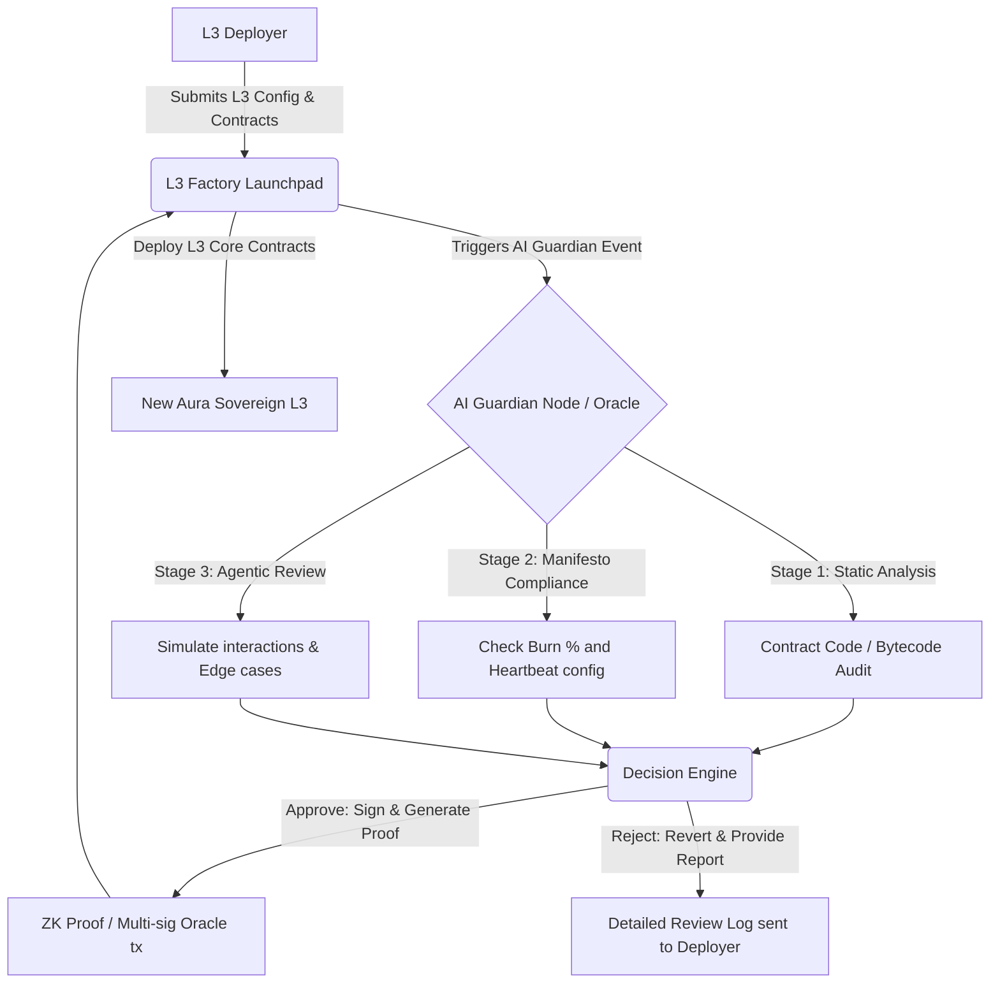

# Aura L3 Deep Dive: AI Guardian Review Module

## 1. Overview
The AI Guardian is a core, non-removable module in the Aura L3 framework. Unlike traditional Rollup-as-a-Service (RaaS) where anyone can deploy any arbitrary execution environment, Aura requires a "Manifesto Check" and "Continuous Audit" administered partly by an AI Oracle network.

**Objective:**
- Prevent deployment of malicious L3s (rug-pulls, honeypots).
- Enforce the "Aura Core Principles" (e.g., minimum 1% burn, Heartbeat enablement).
- Audit cross-chain interactions and fast-bridging anomalies.

## 2. Architecture Diagram (AI Guardian Pipeline)



## 3. On-chain Implementation (Solidity)

Here is a simplified standard on-chain interaction showing the AI Guardian bridging its off-chain review to the on-chain L3 Factory via a `GuardianOracle`.

```solidity
// SPDX-License-Identifier: MIT
pragma solidity ^0.8.20;

interface IAIGuardianOracle {
    function verifyDeployment(bytes32 deploymentHash, bytes memory signatureOrProof) external view returns (bool);
}

contract AuraL3Factory {
    IAIGuardianOracle public guardianOracle;
    uint256 public constant MIN_BURN_BPS = 100; // 1%

    event L3Requested(address indexed deployer, bytes32 indexed deploymentHash, string configUri);
    event L3Deployed(address indexed l3Contract, string name);

    mapping(bytes32 => bool) public isApproved;

    constructor(address _guardianOracle) {
        guardianOracle = IAIGuardianOracle(_guardianOracle);
    }

    // Step 1: Deployer submits configuration
    function requestL3Deployment(bytes memory l3Config, string memory configUri) external returns (bytes32) {
        bytes32 deploymentHash = keccak256(abi.encodePacked(l3Config, configUri, msg.sender));
        emit L3Requested(msg.sender, deploymentHash, configUri);
        return deploymentHash;
    }

    // Step 2: Guardian network evaluates off-chain and approves on-chain
    function approveL3(bytes32 deploymentHash, bytes memory proof) external {
        // Enforce AI Guardian approval
        require(guardianOracle.verifyDeployment(deploymentHash, proof), "AI Guardian: Review Failed");
        isApproved[deploymentHash] = true;
    }

    // Step 3: Deployment executes after approval
    function deployL3(bytes memory l3Config) external returns (address) {
        // Pseudo logic to ensure core modules are included (e.g. Burn, Heartbeat)
        
        require(isApproved[keccak256(l3Config)], "L3 Factory: Waiting for AI Guardian");
        
        /* 
        (uint256 burnRate, bool hasHeartbeat) = parseConfig(l3Config);
        require(burnRate >= MIN_BURN_BPS, "Aura Manifesto: Minimum 1% burn required");
        require(hasHeartbeat, "Aura Manifesto: Heartbeat module required");
        */

        // ... Logic to deploy Rollup standard contracts
        address newL3 = address(0x123); // Placeholder
        emit L3Deployed(newL3, "Aura Ecosystem L3");
        
        return newL3;
    }
}
```

## 4. Off-Chain AI Guardian Spec (TypeScript / Python Context)

The off-chain AI node listens to the `L3Requested` event.

```typescript
import { ethers } from "ethers";
import { runAIAgentAudit } from "./AIGuardianCore";

async function listenForL3Deployments(factoryAddress: string, provider: ethers.Provider) {
    const factory = new ethers.Contract(factoryAddress, L3FactoryABI, provider);

    factory.on("L3Requested", async (deployer, deploymentHash, configUri) => {
        console.log(`New L3 Review Requested: ${deploymentHash}`);
        
        // 1. Fetch Config from IPFS/Arweave using configUri
        const l3Config = await fetchConfig(configUri);
        
        // 2. Run Comprehensive AI Audit
        const auditResult = await runAIAgentAudit({
            contracts: l3Config.customContracts,
            parameters: l3Config.rollupParams,
            deployerAddress: deployer
        });

        // 3. Take Action based on the review logic
        if (auditResult.isSafe && auditResult.compliesWithManifesto) {
            console.log(`Approving L3 Framework for ${deploymentHash}`);
            await submitGuardianSignature(deploymentHash, auditResult.proof);
        } else {
            console.warn(`L3 Rejected: ${auditResult.rejectionReason}`);
            // Provide feedback via external API or dedicated failure event
        }
    });
}
```

## 5. Next Steps for Implementation
To make this real in the current repository:
1. **Develop `AIGuardianCore` AI Agent:** Using a framework like LangChain or AutoGen to execute standard sub-audits (Slither, Mythril) plus custom LLM prompts against the Aura Manifesto.
2. **Oracle Integration Setup:** Decide whether the Guardian node uses a direct backend wallet (trust-based system temporarily) or moves quickly to an AVS (Actively Validated Service) on EigenLayer for deep crypto-economic security.
